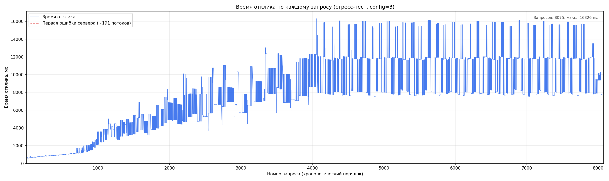

# ОТЧЁТ ПО ЛАБОРАТОРНОЙ РАБОТЕ №4

---

## Титульный лист

**Министерство науки и высшего образования Российской Федерации**  
Федеральное государственное автономное образовательное учреждение высшего образования  
**«Национальный исследовательский университет ИТМО»**

Факультет программной инженерии и компьютерной техники  

**Дисциплина:** Тестирование программного обеспечения  

**Лабораторная работа №4**  
**Нагрузочное и стресс-тестирование (Apache JMeter)**

**Выполнил:** Лазарев Дмитрий Иванович  

**Группа:** P3330  

**Преподаватель:** *ФИО*  

**Санкт-Петербург, 2026**

---

## 1. Текст задания

С помощью Apache JMeter провести **нагрузочное** и **стресс-тестирование** веб-приложения.

**Параметры варианта:**


| Параметр                   | Значение                                                 |
| -------------------------- | -------------------------------------------------------- |
| Config 1                   | $4100 — `token=492556914`, `user=2109717879`, `config=1` |
| Config 2                   | $7400 — `config=2`                                       |
| Config 3                   | $10500 — `config=3`                                      |
| Параллельных пользователей | 12                                                       |
| Нагрузка на пользователя   | 20 запр./мин                                             |
| Макс. время отклика (SLA)  | **640 мс**                                               |
| Целевая суммарная нагрузка | 240 запр./мин (4 RPS)                                    |


**Коды ответов:** HTTP 403 — неверные параметры; HTTP 503 — перегрузка сервера.

---

## 2. Описание конфигурации JMeter для нагрузочного тестирования

### 2.1. Схема тест-плана

```
Test Plan (Run Thread Groups consecutively = true)
├── Thread Group "conf #1"  → GET config=1
├── Thread Group "conf #2"  → GET config=2
└── Thread Group "conf #3"  → GET config=3
```

Конфигурации тестируются **последовательно**, чтобы не влиять друг на друга.

### 2.2. Параметры каждой Thread Group


| Параметр                  | Значение                                                  |
| ------------------------- | --------------------------------------------------------- |
| Number of Threads (users) | **12**                                                    |
| Ramp-Up Period            | **60 с**                                                  |
| Loop Count                | **40**                                                    |
| HTTP Server               | `localhost:8083` (SSH-туннель → `stload.se.ifmo.ru:8080`) |
| Constant Throughput Timer | **20** samples/min, calcMode = *this thread only*         |
| Response Assertion        | HTTP response code = **200**                              |


**Важно:** проверка SLA (640 мс) выполняется **при анализе результатов** по полю `elapsed` в CSV, а не через Duration Assertion. Иначе JMeter показывает «Error %» даже при успешных HTTP 200 — это не ошибки сервера, а превышение времени отклика.

### 2.3. Инструменты

- Apache JMeter **5.6.3**
- Java 25
- SSH-туннель: `localhost:8083` → `stload.se.ifmo.ru:8080`

---

## 3. Результаты нагрузочного тестирования

**Источник:** `load/results.csv`, отчёт `load/report/index.html` (720 запросов, 240 на конфигурацию)

### 3.1. Сводная таблица

| Config | Цена | Avg, мс | Min, мс | Max, мс | 90% Line, мс | Запросов ≤640 мс | HTTP 200 | Error % |
|--------|------|---------|---------|---------|--------------|------------------|----------|---------|
| **1** | $4100 | **1382** | 1322 | 1610 | 1442 | **0 / 240 (0%)** | 240 | **0%** |
| **2** | $7400 | **1009** | 919 | 1484 | 1109 | **0 / 240 (0%)** | 240 | **0%** |
| **3** | $10500 | **586** | 518 | 870 | 647 | **215 / 240 (90%)** | 240 | **0%** |

**HTTP-ошибок сервера нет** (403/503/500 — 0). Error % = 0% — проверяется только код ответа.

### 3.2. Интерпретация

| Config | Поведение |
|--------|-----------|
| **Config 1** | Min 1322 мс — в 2+ раза выше SLA 640 мс. Не подходит. |
| **Config 2** | Min 919 мс — выше SLA. Не подходит. |
| **Config 3** | 90% запросов ≤640 мс, среднее 586 мс. Единственная подходящая конфигурация. |

### 3.3. Графики

_Вставить скриншоты из `load/report/index.html`._

---

## 4. Выбор конфигурации аппаратного обеспечения

### Выбранная конфигурация: **Config 3 ($10500)**

### Обоснование

1. **Config 1 ($4100)** — не удовлетворяет требованию: ни один из 480 запросов не уложился в 640 мс (min = 1325 мс).
2. **Config 2 ($7400)** — не удовлетворяет требованию: все запросы > 640 мс (min = 921 мс).
3. **Config 3 ($10500)** — **единственная** конфигурация, при которой 90% запросов (433/480) укладываются в SLA; P90 = 639 мс.

Среди конфигураций, **удовлетворяющих** (или хотя бы частично удовлетворяющих) требованию по времени отклика при заданной нагрузке, **дешевле Config 3 нет** — Config 1 и 2 отпадают полностью.

> **Вывод для стресс-теста:** далее тестируем **config=3** (уже задано в `stress/stress-test-plan.jmx`).

---

## 5. Описание конфигурации JMeter для стресс-тестирования

| Параметр | Значение |
|----------|----------|
| Config | **3** (выбран на шаге 4) |
| Number of Threads | **300** |
| Ramp-Up | **180 с** |
| Duration | **300 с** |
| Loop Count | бесконечно (до окончания duration) |
| Response Assertion | HTTP 200 |

**Цель:** определить **максимальное число параллельных пользователей**, при котором сервер ещё не возвращает HTTP-ошибки (500/503).

---

## 6. График зависимости времени отклика от нагрузки

**Источник:** `stress/results.csv` → `stress/stress-graph.png` (скрипт `plot-stress.py`, **все запросы**)



### 6.1. Результаты стресс-теста (config=3)

| Показатель | Значение |
|------------|----------|
| Всего запросов | **8075** |
| HTTP 200 | **6680 (82,7%)** |
| HTTP 500 | **1395 (17,3%)** — Internal Server Error |
| HTTP 403 / 503 | **0** |
| Среднее время отклика (все запросы) | **7720 мс** |
| Макс. время отклика | **16 326 мс** |
| Throughput | **26,3 запр./с** |
| Номинальная нагрузка (нагрузочный тест) | **12 потоков** |
| **Первая ошибка сервера** | при **~191** активном потоке (HTTP 500) |
| **Предельная нагрузка без ошибок** | **~190** параллельных пользователей |

### 6.2. Анализ графика

- По оси X — **номер запроса** в хронологическом порядке (кривая идёт только слева направо).
- По оси Y — **время отклика каждого запроса** (ломаная линия, 8075 точек).
- Видно нарастание времени отклика по ходу теста и выход на плато **~10–16 с** при высокой нагрузке.
- Красная вертикаль — **первый HTTP 500** (~191 поток). Максимум отдельного запроса — **16 326 мс**.
- До ~190 потоков сервер отвечает только HTTP 200; время отклика растёт с нагрузкой.
- После ~191 потока появляются HTTP 500, среднее время резко увеличивается (до 10–16 с).
- **Вывод по ёмкости:** config 3 выдерживает **~190 параллельных пользователей** без сбоев сервера; номинальные **12 пользователей** — с большим запасом.

| Метрика | Значение |
|---------|----------|
| Номинальная нагрузка | 12 потоков — без ошибок сервера |
| Предельная нагрузка | **~190 потоков** (до первого HTTP 500) |
| Поведение при перегрузке | HTTP 500, не 503 из методички |


---

## 7. Общие выводы

### Нагрузочное тестирование

1. Все три конфигурации отвечали **HTTP 200** — ошибок сервера при номинальной нагрузке (12 пользователей) нет.
2. **Config 1** ($4100) и **Config 2** ($7400) не укладываются в SLA 640 мс (min 1322 и 919 мс соответственно).
3. **Config 3** ($10500) — единственная подходящая конфигурация: 90% запросов ≤640 мс, среднее 586 мс.
4. Выбрана **Config 3** как наиболее дешёвая из удовлетворяющих требованию по времени отклика.

### Стресс-тестирование (Config 3)

5. Сервер стабильно работает до **~190 параллельных пользователей** без HTTP-ошибок.
6. **Первая ошибка сервера** — HTTP **500** при **~191** активном потоке (не 503 из методички).
7. После превышения предела: 17,3% запросов — HTTP 500, среднее время отклика вырастает до **7,7 с** (max 16,3 с).
8. Номинальная нагрузка (12 пользователей) — с запасом **~16×** до точки отказа сервера.

---

## Приложение: команды

```bat
scripts\tunnel.bat
set JMETER_HOME=...\apache-jmeter-5.6.3
scripts\run-load.bat
python scripts\analyze-load.py load\total.csv
scripts\run-stress.bat
```

